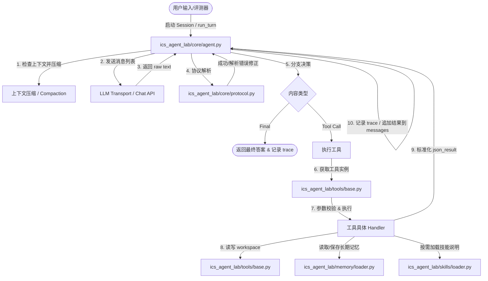

# ICS Agent Lab 答辩通关与核心要点掌握指南

本指南旨在帮助你快速、透彻地掌握整个 ICS Agent Lab 项目。大纲根据项目的四个核心模块（Core、Memory、Skills、Tools）以及三大业务场景展开，并针对答辩老师可能会提出的问题，提供模拟 Q&A。

---

## 1. 整体架构与设计原则

本项目实现了一个**基于大模型（LLM）的自主智能体（Agent）循环**。与业界常见的 LangChain 或 AutoGPT 等重度框架不同，本项目遵循**精简、零第三方 Agent 依赖、完全手写 JSON 协议**的原则，在受限的上下文（Context）和 Token 消耗下高效完成任务。

以下是系统的核心模块协作关系：



---

## 2. Core 模块：大模型循环与上下文控制

### 核心原理
Core 模块是 Agent 的大脑与中枢神经系统，位于 [ics_agent_lab/core](./ics_agent_lab/core/) 目录。它定义了 Agent 的单步循环与对话状态管理。

*   **Agent 循环 (Agent Loop)**：在 [Agent.run_turn](./ics_agent_lab/core/agent.py#L118) 中实现。Agent 会持续循环，直到大模型返回 `{"type": "final"}` 或达到 `max_steps` 上限。
*   **手动 JSON 协议 (Manual JSON Protocol)**：由于**禁止使用 SDK 的 function calling**，所有与 LLM 的交互必须通过纯文本。我们通过系统提示词（System Prompt）强制约束 LLM 必须以 JSON 格式输出且仅包含两种情况：
    1.  工具调用：`{"type": "tool_call", "name": "<name>", "arguments": {...}}`
    2.  最终回答：`{"type": "final", "content": "..."}`
*   **解析错误自动修复 (Self-Repair)**：当大模型输出非法 JSON（如携带 Markdown 的 ` ```json ` 标记或格式破损）时，[ManualJsonProtocol.parse](./ics_agent_lab/core/protocol.py#L49) 捕获错误，并将 `ParseError` 原因作为 `repair_prompt` 追加到对话历史中，给予大模型重新纠错的机会（最多 `max_parse_repairs` 次）。
*   **双重上下文压缩机制 (Double Context Compaction)**：为了降低 Token 消耗并防止关键历史信息在长对话中丢失：
    1.  **无状态规则截断 (Zero-Request Rule-based Truncation)**：对大模型返回的极长工具输出或过长输入，直接将其异步写入本地磁盘 `.agent_memory/long_outputs/` 中，并在上下文中将其替换为短指针（例如 `[Too long. Saved to step_X.txt...]`），节省不必要的 Token 传输。
    2.  **LLM 状态压缩 (LLM Compaction)**：当历史消息数或估算 Token 超过设定的阈值，Agent 会将历史的“系统消息与当前最新轮次之间”的对话内容抽取出来，请求大模型生成一份**在 120 字以内的精简摘要（保留所有路径、密钥、状态关键信息）**。然后将原有的多条历史消息直接缩减为单条汇总消息，实现无损上下文剪枝。

---

## 3. Memory 模块：跨会话持久记忆存储

### 核心原理
Memory 模块位于 [ics_agent_lab/memory](./ics_agent_lab/memory/) 目录。它的目标是提供跨 Session 运行的持久事实和偏好记录，防止 Agent 在下一次启动时丢失“历史记忆”。

*   **按需加载 (On-Demand Retrieval)**：为了极致压缩 Prompt 长度，在 [Agent.new_session](./ics_agent_lab/core/agent.py#L100) 时，System Prompt 中**仅注入已存在记忆的 Key 列表**（通过 [MemoryLoader.descriptions](./ics_agent_lab/memory/loader.py#L59) 获取）。完整的记忆正文只有在 Agent 通过 `read_memory(key)` 工具明确查询时才会加载进上下文。
*   **本地 Markdown 存储**：每条记忆在磁盘上以 `.md` 格式存储，文件名是通过对 Key 进行 MD5 哈希化得到（可规避非法字符引起的文件读写异常），文件第一行为标题 `# <key>`，后续为正文。
*   **写入鲁棒性设计**：
    1.  **大小写不敏感匹配覆盖**：避免因大模型在不同 Step 中对 Key 的大小写混淆（如 `UserPreference` 与 `userpreference`）而产生冗余存储。
    2.  **原子写入 (Atomic Safe Write)**：先将新内容写入 `.tmp` 临时文件，再利用重命名 `Path.rename` 将其替换目标文件。防止在写盘过程中程序异常中断导致已存数据损坏。
    3.  **冗余 I/O 过滤**：每次写文件前比对内容，内容完全一致时跳过磁盘 I/O 写入。

---

## 4. Skills 模块：按需装载的技能系统

### 核心原理
Skills 模块位于 [ics_agent_lab/skills](./ics_agent_lab/skills/) 目录。它用于向大模型传授针对特定复杂业务流程的专业操作规程（如“数据脱敏的标准步骤”）。

*   **Markdown Front-Matter 解析**：每个技能均在独立的 `skills/<name>/SKILL.md` 中以 Markdown 编写，并在头部添加 YAML 元数据 Front-Matter（用 `---` 包裹），如：
    ```markdown
    ---
    name: patch-review
    description: Code review rules and security check workflow
    ---
    ```
*   **摘要声明与延迟装载 (Lazy Loading)**：
    *   在主会话 System Prompt 中，仅注入 `Skill` 的 `name` 和 `description` 的索引（列表摘要）。
    *   当大模型识别到任务属于某个专业领域时，通过调用工具 `load_skill(name)` 读取 [SkillLoader.content](./ics_agent_lab/skills/loader.py#L74)，将具体的工作流、核对单（Checklist）和决策依据动态加载至上下文中。这避免了把多余的场景技能全部塞入 System Prompt，节省了大量 Token 开销。

---

## 5. Tools 模块：动态发现与安全执行沙箱

### 核心原理
Tools 模块位于 [ics_agent_lab/tools](./ics_agent_lab/tools/) 目录。它负责向下打通真实操作系统与外部服务的交互能力。

*   **动态模块发现与注册 (Dynamic Discover & Register)**：
    *   在 [builder.py](./ics_agent_lab/tools/builder.py) 中，使用 `pkgutil.iter_modules` 扫描指定路径下的所有 Python 脚本，并通过 `importlib` 进行动态载入。
    *   每个工具文件必须暴露一个 `make_tool(...)` 构造器。
*   **动态依赖注入 (Dependency Injection)**：
    *   [make_tool_from_module](./ics_agent_lab/tools/builder.py#L90) 会使用 Python 的 `inspect.signature` 去探测 `make_tool` 的参数列表。
    *   根据探测结果，自动注入对应运行时所需要的资源（如 [Workspace](./ics_agent_lab/tools/base.py#L45) 实例、`SkillLoader` 实例、`MemoryLoader` 实例或子智能体运行器 `subagent_runner`）。
*   **安全路径防护与逃逸阻断 (Path Traversal Protection)**：
    *   所有的文件类工具（如 `read_file`, `write_file`, `edit_file`）在解析路径时，必须调用 [Workspace.resolve](./ics_agent_lab/tools/base.py#L55)。
    *   它通过对比解析出的绝对路径（`resolve().absolute()`）是否属于 Workspace 的根目录的子树，即判断 `root not in candidate.parents and candidate != root`。一旦检测到类似 `../../` 的逃逸行为，立即抛出 `ValueError` 并阻断访问。
*   **标准化返回结构**：
    *   工具处理器的异常都会被捕获，并封装进 `json_result(ok=False, error=...)`，避免内部崩溃导致 Agent 循环中断。
    *   在 [validate_arguments](./ics_agent_lab/tools/base.py#L97) 中在工具执行前做类型校验（如 `string`、`integer` 和 `required` 约束），保证传入参数的确定性。

---

## 6. 三大业务场景解析

在 [assignments/](./assignments/) 中，有三个需要结合特定 Tools 和 Skills 共同完成的业务场景。

### ① 数据脱敏挑战 (data_redaction)
*   **业务逻辑**：读取用户填写的原始工单，识别其中的敏感信息（邮箱、手机号、学号、Token、IP 等），并以占位符替换。同时必须保留系统的故障现场上下文（如具体报错信息、配置参数等），并通过 `validate_redaction` 校验，无异常后再通过 `submit_redacted_ticket` 提交。
*   **关键实现点**：
    *   在 [data_redaction/tools](./assignments/data_redaction/tools/) 下的 `submit_redacted_ticket.py` 内部：校验通过后需要将脱敏后的版本同步写出到 Workspace 的 `redacted_ticket.txt` 文件中。

### ② 短时调度通知挑战 (ephemeral_dispatch)
*   **核心痛点**：获取到的 `token` 具有时效性（**200 毫秒后即过期**）。
*   **应对方案**：如果按照传统步骤（Step 1: 申请 Token -> Step 2: 返回 LLM -> Step 3: LLM 解析 -> Step 4: 读 Notice），由于 LLM 网络往返需要秒级时间，Token 绝对会在中途过期。
*   **实现细节**：在 [ephemeral_dispatch/tools/dispatch.py](./assignments/ephemeral_dispatch/tools/dispatch.py) 中，设计了一个**原子组合工具 `fetch_and_dispatch`**。工具的 Handler 在 Python 进程内部连续、同步地运行 `request_dispatch_token()`、`read_dispatch_notice(token)` 以及 `notify_user(notice)`。因为内部调用属于内存级延迟（<1ms），完全可以规避 200ms 的超时问题。

### ③ 变更风险审查挑战 (patch_review)
*   **业务逻辑**：模拟代码评审（Code Review），读取补丁的 diff 细节，若信息不足则通过 `read_patch_file` 查阅特定关联代码，判断该变更是否存在逻辑风险（如是否有 path traversal 漏洞），最后输出包含 Verdict（结论，如 `request_changes`）与 Comments（修复及测试建议）的结构化报告并提交。
*   **实现细节**：在 [submit_review.py](./assignments/patch_review/tools/submit_review.py) 工具成功提交后，将 verdict 和 comments 结构化格式保存为 Workspace 的 `review.txt`。

---

## 7. 模拟答辩 Q&A 百宝箱

为了在答辩时万无一失，以下整理了答辩老师最常问的几个刁钻技术点及标准话术回答：

### Q1: 在 `core.agent` 中，如果大模型输出的 JSON 不合法（比如混杂了 Markdown 标记或格式破损），你是如何处理的？
> **标准回答**：
> 在我的 `ManualJsonProtocol` 模块中，我没有选择抛出异常崩溃，而是实现了一个**自我纠错机制（Self-Repair）**。
> 1. 解析时，我利用 `stripped.find("{")` 和 `stripped.rfind("}")` 截取最外层的大括号范围，从而过滤掉可能伴随输出的 Markdown 代码块声明（\`\`\`json）。
> 2. 我还用 `.replace()` 对大模型经常幻觉生成的中文引号（“ ”）进行了英文双引号规范化处理。
> 3. 如果 `json.loads` 依然失败，我会捕获 `JSONDecodeError`，组装成带有具体报错信息的 `ParseError`。
> 4. Agent 捕获到该错误后，会记录 `parse_error` 轨迹，并自动向大模型发送一条包含了错误原因的 `repair_prompt`，要求它只输出正确格式的 JSON。这极大地保证了系统的容错率与鲁棒性。

### Q2: 既然我们禁止使用大模型厂商原生的 Tool Calling (Function Calling)，你是怎么把工具文档塞给大模型并让它返回工具调用的？
> **标准回答**：
> 1. 我们为每一个注册的 `Tool` 类编写了详细的 JSON Schema 描述（包含参数类型、必填项和参数说明）。
> 2. 在 Agent 创建新 Session 时，[ManualJsonProtocol.build_system_prompt](./ics_agent_lab/core/protocol.py#L25) 会被调用，将工具描述信息转换成**紧凑的单行紧凑模式**（Docs Compact），拼接进 System Prompt。
> 3. 在 Prompt 中，我们用明确的规则要求模型：“你只能在给定的两个 JSON 模板（`tool_call` 或 `final`）中选择其一作为你的唯一输出”。
> 4. 当 LLM 输出后，我们使用自定义的 `parse` 逻辑去提取 JSON，再比对 `ToolRegistry` 并反射执行对应的工具 Handler。

### Q3: 你的上下文压缩（Context Compaction）是怎么做的？它解决了什么问题？如果不做会怎样？
> **标准回答**：
> 我们的上下文压缩机制包含两层：**规则层截断**与**LLM 语义压缩**。
> 1. **解决的问题**：大模型的上下文窗口 is 有限的，且 Token 数量越多，API 计费越高。随着工具调用次数变多，历史消息极易膨胀导致早期的核心指令或凭证被模型遗忘。
> 2. **规则截断**：对于过长的单条工具输出（如大段的文件内容），我们将其异步保存到磁盘，并在上下文历史消息中只替换为一个文本文件指针，避免大段无用文本持续占据 Context。
> 3. **LLM 语义压缩**：当消息数量或预估 Token 超过设定阈值时，我们会截取除“系统 prompt”和“最近三轮对话”之外的全部历史，传递给 LLM，要求它基于之前的历史重新生成一份**120 字以内的无损总结**（要求保留关键的路径、ID、密钥等）。接着将这段总结作为唯一的 System Summary 插入历史，将冗长的中间步骤全部清除，从而达到了极高的数据压缩比。

### Q4: 在 Memory 模块中，你是如何实现“跨 Session”事实存储的？为什么要设计成“按需加载”？
> **标准回答**：
> 1. **持久化实现**：我们设计了 `MemoryLoader`，将跨会话需要保留的稳定事实或用户偏好以 Markdown 文件的形式存储在磁盘上的 `.agent_memory` 目录中。为了避免文件命名带来的特殊字符冲突，我们对 Memory Key 做哈希（MD5）作为文件名。同时，采用了“先写临时文件 `.tmp` 再进行 `rename` 覆盖”的**原子写入模式**，防止突发中断导致的文件内容损坏。
> 2. **按需加载的设计考量**：如果每次启动会话都把所有历史记忆内容无脑塞入 System Prompt，会导致大量的 Token 浪费，且多余的记忆内容会干扰 LLM 执行当前任务。因此，我们在 System Prompt 中**只注入当前已存记忆的 Key 索引列表**。只有当大模型自主识别到当前任务与某个 Key 相关联时，它才会通过调用 `read_memory(key)` 工具把这一条记忆的具体内容加载进当前 Session 的历史。这就做到了对上下文的高效利用。

### Q5: 在 Tools 模块中，如何确保大模型执行文件工具时，不会发生“路径穿透”（Path Traversal）安全漏洞？
> **标准回答**：
> 为了保证系统的安全性，所有的文件操作工具都不是直接把参数传给 `open()`，而是强制通过 `Workspace.resolve(path_str)` 统一解析。
> 1. 在 `resolve` 内部，我们将根目录 `root` 与传入路径进行拼接，并调用 `.resolve()` 获取绝对规范路径。
> 2. 然后，我们判定：解析出来的路径的父目录链中，是否包含了 Workspace 的根目录，即 `root not in candidate.parents and candidate != root`。
> 3. 如果路径参数试图通过 `../../etc/passwd` 等手段跳出 Workspace，该判定会被触发并直接抛出 `ValueError`。工具底层会捕获这个异常并将其以 `{"ok": false, "error": "Path escapes lab workspace."}` 安全返回给模型，有效杜绝了安全沙箱的逃逸。

### Q6: 动态依赖注入（Dependency Injection）在你的 Tools 框架中是如何体现的？
> **标准回答**：
> 在 `builder.py` 中，我们没有在代码中写死每一个工具实例化所需的参数，而是设计了一个灵活的**动态发现与依赖注入机制**。
> 1. 在构建工具注册表时，我们扫描 `tools/` 文件夹及额外的业务目录，提取并载入所有包含 `make_tool` 函数的模块。
> 2. 使用 Python 自带的 `inspect.signature` 库反射获取 `make_tool` 函数的所有形参名称（如 `workspace`、`skill_loader`、`memory_loader`、`subagent_runner`）。
> 3. 接下来，我们自动根据这些形参名称，从全局上下文中匹配同名实例并作为关键字参数传入。这种设计符合“高内聚、低耦合”的软件工程思想，极大方便了后续新工具的扩展。

### Q7: 在短时调度通知任务（ephemeral_dispatch）中，大模型生成的 Token 过期时间是 200ms，而网络请求动辄 1s 以上，你是如何解决这个时效性冲突的？
> **标准回答**：
> 1. **问题根源**：LLM 本身的推理延迟以及网络的往返时延（RTT）通常在数百毫秒到数秒级别，这使得大模型不可能在 200ms 的短时间内完成“获取 Token -> 发回模型 -> 再次调用读取工具”的跨轮交互。
> 2. **解决方案**：我为此设计了一个**高内聚的复合工具（Cohesive Compound Tool）**，即 `fetch_and_dispatch`。
> 3. 大模型无需显式拆分多步，只需调用一次该工具。工具在 Python 进程的内存中同步执行：请求 Token、紧接着传入此 Token 读取通知、再立即分发给用户、并在 Workspace 中留下凭证文件。这一连串的调用全部在本地微秒级的内存中跑完，完全规避了 LLM 交互往返的网络时延，成功在 200ms 过期阈值内完成了调度分发任务。

### Q8: 工具调用在代码中具体是怎么实现的？请理清整个调用链路。
> **标准回答**：
> 工具调用主要经历了以下 4 个阶段：
> 1. **大模型输出与解析**：在 [agent.py](./ics_agent_lab/core/agent.py#L224) 中，Agent 调用 `self.llm.complete(messages)` 获取大模型的 JSON 字符串，接着通过 [ManualJsonProtocol.parse](./ics_agent_lab/core/protocol.py#L49) 进行文本提取（提取 `{` 和 `}` 之间的内容）。如果解析出 `kind == "tool_call"` 的 `ParsedMessage`，则返回给 Agent。
> 2. **进入工具分发**：在 [agent.py:L266](./ics_agent_lab/core/agent.py#L266) 中，Agent 会执行 `tool_result = self.tools.run(parsed.name, parsed.arguments)`。
> 3. **参数校验与 Handler 反射**：在 [ToolRegistry.run](./ics_agent_lab/tools/base.py#L78) 中：
>    * 先检查工具名称是否在已注册的 `self._tools` 字典中。
>    * 调用 `validate_arguments` 比对参数与工具 JSON Schema 的类型 and 必需项约束。
>    * 校验通过后，反射执行 `tool.handler(arguments)` 并捕获任何异常，捕获的异常用 `json_result(ok=False, error=str(exc))` 标准化输出。
> 4. **结果回写大模型**：在 Agent 循环中，工具执行结果被 `sanitize_tool_result` 净化（统一换行符等），记录在 `tool_call` 追踪日志中。然后以 `{"role": "user", "content": f"Result of '{name}':\n{result}"}` 形式追加到 `messages` 列表中，进入下一轮 LLM 交互。

### Q9: 你的 `bash` 命令工具是如何实现安全防护和异常控制的？
> **标准回答**：
> 我们的 `bash` 工具在 [ics_agent_lab/tools/bash.py](./ics_agent_lab/tools/bash.py) 中，针对大模型运行不可控 Shell 命令的隐患，做了三层防护设计：
> 1. **高危关键字拦截**：预先定义 `unsafe_keywords = ["rm -rf /", "mkfs", "dd if="]`，如果命令包含这些危险指令直接阻断运行并报错。
> 2. **执行空间隔离 (CWD 限制)**：在调用 `subprocess.run` 时，将 `cwd` 参数强制限制为 `workspace.resolved_root`（也就是沙箱 workspace 根目录），防止命令在系统敏感目录下执行。
> 3. **超时机制 (Timeout) 与悬挂防范**：通过设置 `timeout=30.0`，如果运行某些需要持续交互或死循环的命令，30 秒后会自动触发 `subprocess.TimeoutExpired` 异常，并在 Exception Handler 中返回 ok=False 及超时提示，防止进程卡死。

### Q10: 评测中 `eval-memory-update`（记忆持久化更新）场景具体是怎么实现的？
> **标准回答**：
> `evals/memory_persistent_update.json` 场景专门设计用来评测跨会话记忆的持久化和覆盖修改能力，它分成了**三个独立会话（Session）**：
> 1. **第一会话**：输入 `"Please remember for future sessions: my preferred name is Lin."`。Agent 应该调用 `save_memory(key="preferred name", content="Lin")`，将记忆写进磁盘文件。
> 2. **第二会话**：输入 `"Update your memory: my preferred name is now Ada, not Lin."`。此时大模型应当调用 `save_memory(key="preferred name", content="Ada")`，将原先的值修改为 Ada。
> 3. **第三会话**：输入 `"What is my current preferred name? Answer with only the current name."`。此时 Agent 会基于 System Prompt 中的记忆 key 列表，识别并调用 `read_memory(key="preferred name")` 获取最新内容 `"Ada"` 并进行回答。
> 4. **评测判定**：测试套件会校验最终输出是否包含 `"Ada"` 且**不包含**旧的 `"Lin"`，同时在 trace 中检查是否在之前的 steps 中正确调用了 `save_memory` 和 `read_memory`。由于三个 Session 是相互独立的进程，任何仅仅保存在内存或单个 messages 历史中的数据均无法通过本评测，必须写入磁盘。

### Q11: 答辩老师如果让你具体讲一下“Memory 是如何更新的”，对应的代码在哪里？
> **标准回答**：
> 具体的 Memory 更新逻辑在 [MemoryLoader.save](./ics_agent_lab/memory/loader.py#L79) 中：
> 1. **匹配旧 key**：首先将传入的 `key` 进行大小写不敏感匹配（`existing_key.lower() == key.lower()`），如果匹配上，就将 `target_key` 设为 `existing_key`。这样如果大模型对 Key 大小写有细微偏差（例如从 Preferred Name 变成了 preferred name），我们依然能在磁盘上覆盖同一个文件，防止写入冗余垃圾记忆。
> 2. **确定文件名**：通过 `hashlib.md5(target_key.encode("utf-8")).hexdigest() + ".md"` 生成文件名，防止 Key 字符引起路径错误。
> 3. **原子安全写盘 (Atomic Write)**：使用临时文件写入（写入 `.tmp` 后再 `rename` 覆盖），防止程序崩溃导致文件损坏。
> 4. **更新缓存**：将 `Memory` 实例更新进内存的 `self.memories` 字典，并重新刷新 `self._last_mtime`。

### Q12: 怎么做上下文压缩（Context Compaction）？请对照代码详细讲解。
> **标准回答**：
> 我们的上下文压缩代码在 [agent.py:L132-221](./ics_agent_lab/core/agent.py#L132-L221) 中，具体分为以下两步运行：
> 1. **触发时机判定**（[agent.py:L133-137](./ics_agent_lab/core/agent.py#L133-L137)）：在每次进入 LLM 完成对话前，Agent 都会先通过 `estimate_messages_tokens` 预估 Token 长度。如果消息条数超过阈值（`compact_after_messages`）或者 Token 数超过阈值（`compact_token_threshold`），则启动压缩。
> 2. **规则截断（无 LLM 调用消耗）**（[agent.py:L142-153](./ics_agent_lab/core/agent.py#L142-L153)）：
>    * 遍历除了最新消息外的所有历史，检查是否有内容极长的用户（工具返回）消息。
>    * 若消息字符长度大于 2000，则调用 `self._async_dump_long_text`，通过线程池将该消息保存到本地文件，并在 `messages` 中将其替换为 `[Too long. Saved to .agent_memory/long_outputs...]` 指针。这一步可以在不调用大模型的情况下迅速减小上下文体积。
> 3. **LLM 语义摘要压缩**（[agent.py:L155-212](./ics_agent_lab/core/agent.py#L155-L212)）：
>    * 若规则截断后仍超限，且距离上一次压缩超过了 3 个 Step，则截取除 System Message (`messages[0]`) 和最新三轮消息 (`kept_recent`) 以外的中间对话历史 `to_summarize`。
>    * 我们对要压缩的中间文本进行预剪枝（首尾截取，[agent.py:L180](./ics_agent_lab/core/agent.py#L180)），组装成求和 Prompt 传给大模型。
>    * 大模型被要求输出一份 `"under 120 words. Preserve all exact details like names, keys..."` 的摘要。
>    * 得到 `summary_text` 后，我们将 `messages` 列表直接重写为：`[system_msg, {"role": "system", "content": "=== Summary of previous conversation steps ===\n" + summary_text}] + recent_msgs`。这就用一条极短 of Summary 替换了十几条历史消息，极大地降低了 Token。
